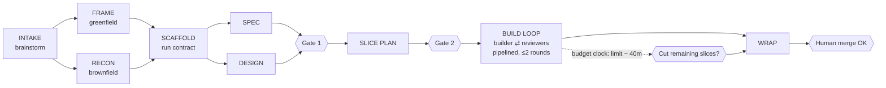
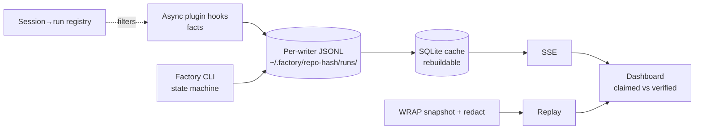

# Architecture Diagrams

## Pipeline

```mermaid
flowchart LR
  I[INTAKE<br/>brainstorm] --> F[FRAME<br/>greenfield]
  I --> R[RECON<br/>brownfield]
  F --> S[SCAFFOLD<br/>run contract]
  R --> S
  S --> SP[SPEC]
  S --> D[DESIGN]
  SP --> G1{{Gate 1}}
  D --> G1
  G1 --> SL[SLICE PLAN] --> G2{{Gate 2}}
  G2 --> B[BUILD LOOP<br/>builder ⇄ reviewers<br/>pipelined, ≤2 rounds]
  B --> W[WRAP] --> M{{Human merge OK}}
  B -. "budget clock: limit − 40m" .-> C{{Cut remaining slices?}}
  C --> W
```

Read-only in main checkout: INTAKE, FRAME/RECON. Worktree (under `~/.factory/<repo-hash>/worktrees/`) from SCAFFOLD onward.

## Truth layer

```mermaid
flowchart LR
  H[Async plugin hooks<br/>facts] --> J[(Per-writer JSONL<br/>~/.factory/repo-hash/runs/)]
  CLI[Factory CLI<br/>state machine] --> J
  REG[Session→run registry] -. filters .-> H
  J --> Q[(SQLite cache<br/>rebuildable)]
  Q --> SSE[SSE] --> UI[Dashboard<br/>claimed vs verified]
  W[WRAP snapshot + redact] --> RP[Replay] --> UI
```
